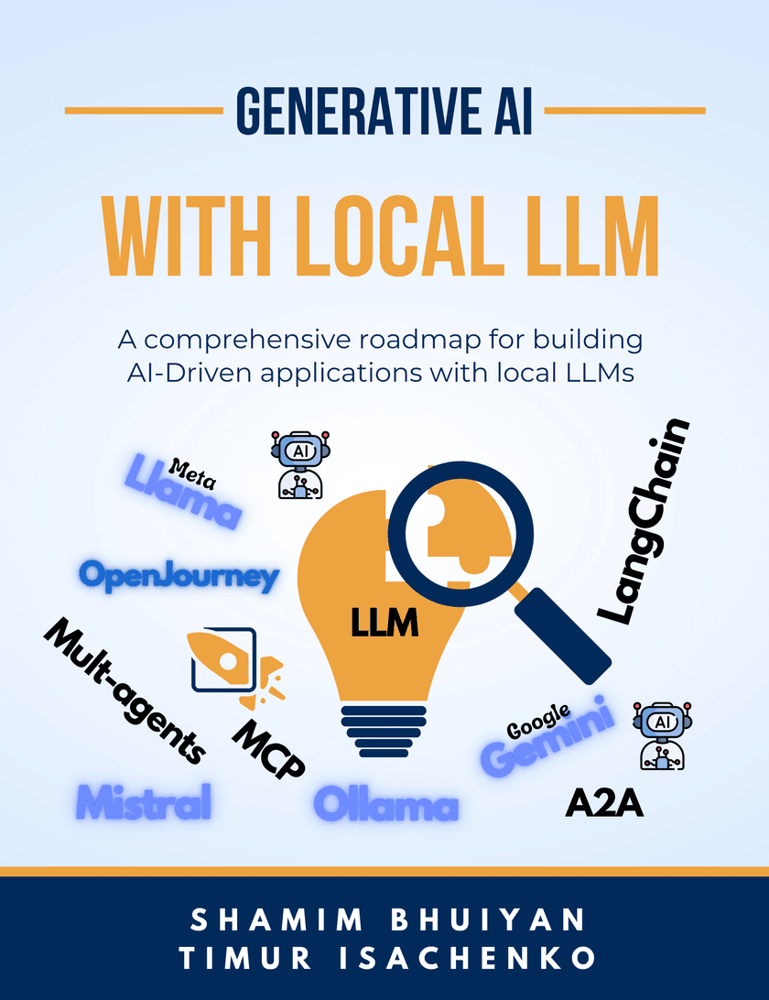

# Generative AI with local LLM
All code samples, scripts and more in-depth examples for the book [Generative AI with local LLM](https://leanpub.com/quickstartwithai)



## Naming conventions

Each chapter in the book has a corresponding folder within the repository. Each folder contains a set of files or folders related to each section of the chapter.

## What is this book about?

This book provides a comprehensive guide to leveraging Generative AI and Large Language Models (LLMs) in a local development environment. It is designed to take you from the basics of Generative AI to advanced techniques like fine-tuning models, enriching them with private datasets, and applying them in practical scenarios such as SQL querying, image processing, and code generation. Whether you're a _product owners_, _developers_, _data scientists_, and _AI enthusiasts_ , this book will equip you with the knowledge and tools needed to effectively utilize AI in your projects.

__Chapter 1. Getting started with Local LLM__

Before diving into AI model implementation, it’s essential to set up a robust local development environment. This chapter guides you through the process of configuring your machine for AI development, including installing necessary software, setting up Python environments, and choosing the right hardware (like GPUs) for optimal performance. The chapter also introduces tools like Docker, Jupyter notebooks which will help streamline your AI development workflow.

__Chapter 2. Deep dive into the theories of Generative AI__

The journey begins with an introduction to Generative AI, explaining what it is, how it works, and why it is revolutionizing various fields. This chapter covers the fundamental concepts of AI, machine learning, and deep learning, laying the groundwork for understanding how LLMs generate content such as text, code, and images. You'll learn about different types of generative models, including GANs, VAEs, and Transformers, and explore their applications across industries.

__Chapter 3: RAG, enrich LLM models with private datasets__

This chapter delves into the concept of Retrieval-Augmented Generation (RAG), a cutting-edge technique that enhances LLMs by integrating them with private datasets. You’ll learn how to enrich your AI models with domain-specific knowledge, enabling them to provide more accurate and relevant outputs. The chapter covers the technical steps to set up RAG, including indexing private data and configuring the model to retrieve and generate responses based on this enriched information.

__Chapter 4: Text-to-SQL, enhance your LLM responses by integrating data from the Database__

AI-driven automation in database interactions is increasingly valuable, and this chapter focuses on using LLMs for Text-to-SQL conversion. You’ll learn how to use models that can translate natural language queries into SQL commands, specifically tailored for interactions with BigQuery. The chapter includes practical examples and code snippets, showing how to create systems that allow users to interact with databases without needing to know SQL, making data retrieval more accessible and efficient.
 
__Chapter 5: Fine tuning LLM model__

This chapter takes a deep dive into the fine-tuning process, a crucial step in customizing LLMs to better suit your specific needs. You’ll explore how to adapt pre-trained models to your data, improving their performance on tasks relevant to your domain. The chapter covers the technical aspects of fine-tuning, including data preparation, adjusting hyperparameters, and evaluating model performance. By the end of this chapter, you’ll be able to refine models to achieve higher accuracy and relevance in your applications.

__Chapter 6: Image processing & generating with LLM__

Generative AI is not limited to text; it also plays a significant role in image processing and generation. This chapter explores how LLMs can be used to create and manipulate images. The chapter provides practical examples and tools, including using models like LLaVa, OpenJourney, to integrate image generation into your projects.

__Chapter 7: Developing and utilizing AI agents__

The final chapter addresses one of the most exciting applications of LLMs: automated code generation and testing. You’ll discover how to use AI to generate code snippets, complete functions, and even write entire programs based on natural language descriptions. The chapter also covers automated testing, where LLMs can be used to generate test cases and validate code, improving the efficiency and reliability of software development. Practical examples and case studies illustrate how these tools can streamline the coding process, reduce errors, and accelerate development timelines.

__Chapter 8: Advanced Tools and Techniques__

The final chapter provided a comprehensive exploration of advanced tools and techniques for enhancing AI applications using the Model Context Protocol (MCP) framework and Minion(s) protocol. The chapter highlighted how tools like mcp-cli empower developers to experiment with language models and interact with MCP servers programmatically. This opens up possibilities for automating tasks, summarizing content, and accessing structured data through AI-driven prompts.

## Prerequirities

| Tools and framework | Description |
|---|---|
| LLM runner | Ollama, Groq |
| LLM | Llama, Qwen, codestral, Llava, Openjourney |
| Programming language | Python |
| App developing | Langchain, Vanna, CrewAI, OpenAI SDK |
| ML platform  | Hugging face |
| Image processin | PyTorch |

## Conventions

The following typographical conventions are used in this book:

1. _Italic_ and __Bold__ indicates new terms, important words, URL's, filenames, and file extensions.

2. A block code is set as follows:

```python
def process_image(image_file_path, prompt):
    print(f"\nProcessing {image_file_path} file \n")
    image = Image.open(image_file_path)
    display(image)
    
    with image as img:
        with BytesIO() as buffer:
            img.save(buffer, format='PNG')
            image_bytes = buffer.getvalue()

    # Generate a description of the image
    for response in generate(model='llava:34b', 
                             prompt=prompt, 
                             images=[image_bytes], 
                             stream=True):
        # Print the response to the console and add it to the full response
        print(response['response'], end='', flush=True)
```

3. Any command-line __input__ or __output__ is written as follows:

```
!pip install ollama

export OLLAMA_HOST="192.168.1.124"

Processing ./Text2SQL.png file 
```


